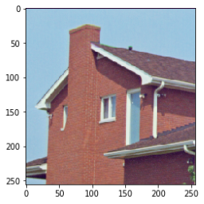

# 第三次作业

**（1）安装pytorch**

**（2）运行所有ipynb文件**

**（3）视频人脸检测**

## 安装pytorch
```sh
# windows上安装cpu版本的pytorch
conda create -n pytorch1.7 python=3.6
activate pytorch1.7
conda install pytorch==1.7.1 torchvision==0.8.2 torchaudio==0.7.2 cpu
```

## 运行所有ipynb文件 
代表中缺少House256rgb.png，我用代码中输出的中间结果(下图)替代原始图片。[运行结果](./ipynb) 。




## 视频人脸检测
**原视频**

这是一段跳舞的视频，剪辑自周杰伦的MV。(如有侵权，立刻删除)


**Opencv版本**

用作业二中的代码逐帧检测视频中的人脸。由于视频中存在遮挡，所以使用Opencv很可能检测不到人脸。[代码](./code/face_detection_opencv.py) 。 


**百度Api版本**

尝试用百度Api检测视频中的人脸。可以看到大部分帧的人脸都被检测出来了。 [代码](./code/face_detection_baiduapi.py) 。

